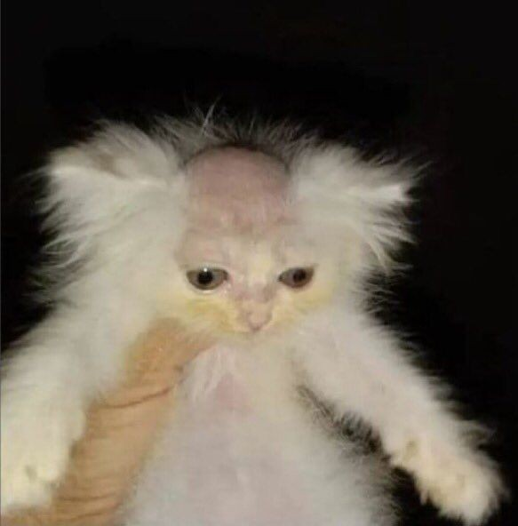
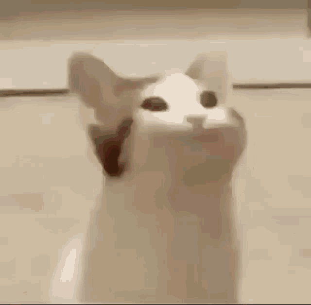
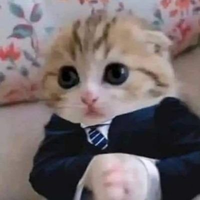
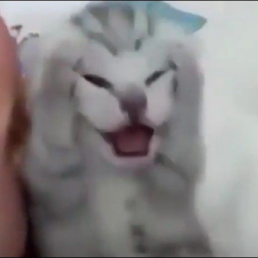

## **Henrique Venâncio**

### **Formação Acadêmica:** 

Curso técnico de informática. - **SENAI 2022-2024**  
Ensino médio incompleto. - **EE. DESEMBARGADOR 2022-2024**
                
### **Cursos Livres:**  
           
Curso de organização de eventos. - **SENAC 2022-2022**  
Curso pacote Office(Word, Excel, Power Point). - **SENAI 2022-2022**  
Curso de programação e robótica. - **PREF. SGRA 2021-2021**  
Curso de inglês. - **PREF. SGRA 2020-2020**  
Curso de violão. - **PREF. SGRA 2019-2019**  
           
### **Soft Skills/Hard Skills:**  
Comunicação  
Foco em resultados  
Liderança  
Inteligência emocional  
Capacidade de inovação  
Colaboração e trabalho em equipe  
Capacidade de adaptação  
Logica de programação
            
### **Sobre a minha pessoa:**  

Como um entusiasta da programação, minha paixão por gatos é inquestionável (embora nenhum felino tenha me coagido a mencionar isso). Durante meu período de estudos no técnico de informática, descobri o fascínio pelo mundo da programação e decidi seguir esse caminho apaixonante. Embora sempre tenha alimentado o sonho de me tornar um programador, por um tempo, a falta do incentivo adequado fez com que eu deixasse esse desejo em segundo plano. No entanto, quando a oportunidade se apresentou, revivi meu sonho e decidi perseguir ativamente minha carreira na área.

Além do código, encontro satisfação em minhas atividades de lazer. Sou um jogador habilidoso, para dizer o mínimo, e desfruto programando por pura diversão. Além disso, meu tempo livre é preenchido com alegria ao assistir vídeos, animes e mergulhar nas páginas de mangás. Tenho uma preferência especial por ter a versão física dos mangás que leio. A sensação única de segurar um mangá nas mãos, pronto para ser lido a qualquer momento, proporciona uma experiência que a versão digital simplesmente não consegue replicar. Por esses e outros motivos, estou sempre aberto e entusiasmado para discutir esses assuntos.

### **Meus objetivos:**  

Um dos meus grandes objetivos é transformar em realidade o meu sonho de visitar o Japão. Estou trabalhando nisso aos poucos, construindo o caminho para tornar essa experiência única uma parte tangível da minha jornada.

Além disso, outro sonho que alimento é criar um jogo de sucesso. A diferença é que não estou apenas interessado em ser parte de um jogo AAA convencional. Meu desejo vai além: quero desenvolver um jogo que seja a expressão pura das minhas ideias, com total liberdade criativa e artística. Tenho uma profunda admiração pelos jogos indies, verdadeiras obras de arte que desafiam as fórmulas convencionais. Esses jogos inovadores, muitas vezes feitos com paixão, exploram ideias que as grandes empresas hesitariam em testar. Apesar de nem todos alcançarem reconhecimento ou qualidade excepcionais, acredito que criar algo com o coração pode ter um valor muito além do financeiro.

Enquanto me inspiro nos jogos indie, reconheço que muitas grandes empresas também produzem títulos incríveis que deixam uma marca duradoura. Esses jogos, que se tornam parte da cultura e são aclamados ao longo do tempo, são a prova de que meu sonho não é apenas possível, mas alcançável. Estou determinado a realizar esses objetivos, sabendo que a jornada será tão valiosa quanto a chegada. Por enquanto, essas são as estrelas guias dos meus objetivos principais.

                   
